# 🤖 AI Agent for Car Sales

## 📱 Ejemplos de Conversación

### Previsualización de la Conversación
Aquí puedes ver ejemplos visuales de cómo se ve la conversación en WhatsApp:


### 1. Búsqueda Inicial
```
[Usuario] Hola 👋
[Bot] ¡Hola! Soy tu asistente para encontrar el auto ideal en Kavak 🚗
¿Qué tipo de auto estás buscando?

[Usuario] Busco un auto económico familiar
[Bot] Entiendo que buscas un auto económico y familiar. Te sugiero estas opciones:

🚗 Chevrolet Spark ACTIV D 2021
💰 $325,000
📏 5 puertas
🎵 Bluetooth y CarPlay
⛽ Económico en consumo

🚗 Volkswagen Vento 2020
💰 $350,000
📏 4 puertas
🎵 Bluetooth y CarPlay
🛋️ Espacioso

¿Te gustaría saber más detalles de alguno de estos autos?
```

### 2. Consulta de Características
```
[Usuario] ¿Tiene bluetooth el Spark?
[Bot] ¡Sí! El Chevrolet Spark ACTIV D incluye:
🎵 Bluetooth
📱 CarPlay
🎧 Entrada auxiliar
🔊 6 bocinas

¿Te gustaría agendar una cita para conocerlo en persona? 
También puedo mostrarte más opciones si lo prefieres.

[Usuario] Muéstrame más opciones
[Bot] Aquí tienes más opciones económicas y familiares:

🚗 Nissan Versa 2021
💰 $340,000
📏 4 puertas
🎵 Bluetooth y CarPlay
🛋️ Amplio espacio interior

🚗 Kia Rio 2020
💰 $360,000
📏 4 puertas
🎵 Bluetooth y CarPlay
🔋 Bajo consumo de combustible

¿Alguna de estas opciones te interesa? Puedo darte más detalles o ayudarte a calcular el financiamiento.
```

### 3. Financiamiento
```
[Usuario] ¿Cuánto sería la mensualidad del Versa?
[Bot] Para el Nissan Versa 2021 ($340,000), te muestro las opciones de financiamiento:

📊 Opción 1:
💰 Enganche: $68,000 (20%)
📅 Plazo: 48 meses
💵 Mensualidad: $7,850
📈 Tasa: 10.9% anual

📊 Opción 2:
💰 Enganche: $102,000 (30%)
📅 Plazo: 36 meses
💵 Mensualidad: $8,200
📈 Tasa: 10.5% anual

¿Te gustaría agendar una cita para revisar el auto y formalizar el financiamiento?
```

### 4. Agendamiento de Cita
```
[Usuario] Sí, me interesa
[Bot] Perfecto, para agendar tu cita necesito algunos datos:

1️⃣ ¿Qué día te gustaría visitarnos? (L-V 9:00-18:00, S 9:00-14:00)
2️⃣ ¿A qué hora te acomoda?
3️⃣ ¿Cuál es tu nombre completo?

[Usuario] Mañana a las 11
[Bot] Para agendar tu cita necesito tu nombre completo para registrarte en el sistema.

[Usuario] Juan Pérez
[Bot] ¡Perfecto! Tu cita ha sido agendada:

📅 Fecha: [Fecha de mañana]
⏰ Hora: 11:00
🚗 Auto: Nissan Versa 2021
👤 Nombre: Juan Pérez

Te enviaré un recordatorio por WhatsApp. ¿Hay algo más en lo que pueda ayudarte?
```

### 5. Finalización y MSAT
```
[Usuario] No, gracias
[Bot] ¡Gracias por tu interés! 

¿Podrías calificar tu experiencia con nuestro asistente del 1 al 5, donde:
1 = Muy insatisfecho
2 = Insatisfecho
3 = Neutral
4 = Satisfecho
5 = Muy satisfecho

Responde solo con el número de tu calificación.

[Usuario] 5
[Bot] ¡Gracias por tu excelente calificación! 🙏
Nos alegra que hayas tenido una gran experiencia con nuestro asistente.
```

## 📱 Asistente de IA para Venta de Autos

Asistente de IA para ayudar a los clientes a encontrar su auto ideal en el catálogo de Autos.

## Prueba de la Aplicación

### 1. Configurar WhatsApp Sandbox
1. Abrir WhatsApp en tu teléfono
2. Agregar el número: +14155238886
3. Enviar mensaje: `join look-quietly`
4. Esperar confirmación de que te has unido al sandbox

Alternativamente, puedes:
- Hacer clic en [este enlace](http://wa.me/+14155238886?text=join%20look-quietly) para abrir WhatsApp directamente
- Escanear el código QR (si está disponible)
- Enviar mensaje: `join look-quietly`

### 2. Probar la Aplicación
Una vez unido al sandbox, puedes probar los siguientes comandos:

#### Búsqueda de Autos
```
Hola, busco un auto económico familiar
```
```
Muéstrame Volkswagens Golf
```
```
Autos entre 300 y 400 mil pesos
```
```
Autos con bluetooth y carplay
```

#### Financiamiento
```
Calcula el financiamiento para un auto de 500 mil pesos con enganche de 100 mil
```
```
Muéstrame opciones a 48 meses
```

#### Detalles
```
Dame más detalles del Volkswagen Golf GTI Performance
```
```
Muéstrame más Chevrolets Spark ACTIV D
```

### 3. Verificar Funcionamiento
1. **Respuestas del Bot**:
   - Deberías recibir respuestas en segundos
   - Las respuestas deben ser relevantes a tu búsqueda
   - El bot debe mantener el contexto de la conversación

2. **Monitoreo**:
   - Revisar CloudWatch Logs para ver el flujo de la conversación
   - Verificar Step Functions para ver el procesamiento
   - Monitorear DynamoDB para ver las consultas

3. **Solución de Problemas**:
   - Si no recibes respuesta, verificar:
     - Que estás en el sandbox correcto
     - Que el webhook está configurado
     - Que las funciones Lambda están activas
   - Si la respuesta es incorrecta:
     - Verificar logs de la función de chat
     - Revisar embeddings en DynamoDB
     - Comprobar el catálogo de autos

### 4. Notas Importantes
- El sandbox de WhatsApp tiene límites de uso
- Las respuestas pueden tardar unos segundos
- El bot mantiene contexto por 24 horas
- Los embeddings se actualizan diariamente
- Las búsquedas son semánticas, puedes usar lenguaje natural

## Características

### Búsqueda Semántica de Autos
- Búsqueda por descripción natural (ej: "un auto económico familiar")
- Búsqueda por marca y modelo específicos
- Búsqueda por rango de precio y año
- Búsqueda por características específicas (bluetooth, carplay)
- Resultados ordenados por relevancia

### Características Disponibles
- Marca, modelo, versión y año
- Precio y kilometraje
- Dimensiones (largo, ancho, altura)
- Características (bluetooth, carplay)

### Financiamiento
- Cálculo de opciones de financiamiento
- Diferentes plazos (36 a 72 meses)
- Tasa de interés personalizable
- Cálculo de mensualidades

### Conversación Natural
- Mantiene contexto de la conversación
- Resumen automático de preferencias
- Respuestas personalizadas
- Manejo de múltiples criterios de búsqueda

## Arquitectura

### Diagrama General

```mermaid
graph TB
    subgraph Cliente
        WA[WhatsApp] -->|Mensaje| TW[Twilio]
    end

    subgraph AWS
        subgraph API Gateway
            TW -->|Webhook| APIG[API Gateway]
        end

        subgraph Step Functions
            APIG -->|Inicia| SF1[Flujo de Conversación]
            SF1 -->|Procesa| L1[Lambda Chat process_message]
            SF1 -->|Responde| L3[Lambda Webhook send_response]
            SF1 -->|Guarda Prospecto| L4[Lambda Save Prospecto process_message]
            SF1 -->|MSAT| L5[Lambda MSAT process_message]
            CW[CloudWatch Events] -->|Trigger Diario| SF2[Flujo de Embeddings]
            SF2 -->|Actualiza| L2[Lambda Embeddings update_embeddings]
        end

        subgraph DynamoDB
            L1 -->|Lee/Escribe| DB1[Conversaciones]
            L1 -->|Consulta| DB2[Embeddings]
            L2 -->|Lee/Escribe| DB2[Embeddings]
            L2 -->|Lee| DB3[Catálogo]
            L4 -->|Guarda| DB4[Prospectos]
            L5 -->|Guarda| DB5[MSAT]
        end

        subgraph OpenAI
            L1 -->|Consulta| GPT[GPT-3.5 Turbo]
            L2 -->|Genera| EMB[Embeddings API]
        end
    end

    L3 -->|Respuesta| WA
```


### Flujos Detallados

#### 1. Flujo de Conversación

```mermaid
stateDiagram-v2
    [*] --> RecibirMensaje
    RecibirMensaje --> ProcesarMensaje
    ProcesarMensaje --> VerificarContexto

    VerificarContexto --> GenerarRespuesta

    GenerarRespuesta --> GuardarProspecto: ¿Es agendamiento?
    GuardarProspecto --> EnviarRespuesta
    GenerarRespuesta --> EnviarRespuesta: Otro caso
    EnviarRespuesta --> SolicitarMSAT: ¿Finaliza conversación?
    SolicitarMSAT --> ProcesarMSAT: Usuario responde MSAT
    ProcesarMSAT --> ActualizarContexto
    EnviarRespuesta --> ActualizarContexto: Si no es MSAT
    ActualizarContexto --> [*]

    state VerificarContexto {
        [*] --> ConsultarDynamoDB
        ConsultarDynamoDB --> VerificarTimestamp
        VerificarTimestamp --> [*]
    }

    state GenerarRespuesta {
        [*] --> ConsultarGPT
        ConsultarGPT --> FormatearRespuesta
        FormatearRespuesta --> [*]
    }
```


#### 2. Flujo de Actualización de Embeddings (Trigger Diario)

```mermaid
stateDiagram-v2
    [*] --> TriggerDiario
    TriggerDiario --> ObtenerCatalogo

    state ProcesarLote {
        [*] --> ObtenerLote
        ObtenerLote --> GenerarEmbedding
        GenerarEmbedding --> GuardarDynamoDB
        GuardarDynamoDB --> [*]
    }

    ObtenerCatalogo --> ProcesarLote
    ProcesarLote --> VerificarMasLotes

    VerificarMasLotes --> ProcesarLote: Hay más lotes
    VerificarMasLotes --> Finalizar: No hay más lotes
    Finalizar --> [*]

    state GenerarEmbedding {
        [*] --> NormalizarTexto
        NormalizarTexto --> ConsultarOpenAI
        ConsultarOpenAI --> [*]
    }
```


### Componentes y Responsabilidades

#### 1. Frontend (WhatsApp + Twilio)
- **WhatsApp**: Interfaz de usuario
- **Twilio**: 
  - Recibe mensajes de WhatsApp
  - Envía mensajes al webhook
  - Maneja la sesión de WhatsApp

#### 2. API Gateway
- Expone endpoints para:
  - Webhook de Twilio
  - Actualización de embeddings
  - Monitoreo y salud

#### 3. Step Functions
- **Flujo de Conversación**:
  - Orquesta el procesamiento de mensajes
  - Maneja actualizaciones de embeddings
  - Gestiona el contexto de la conversación
  - Coordina la generación de respuestas

- **Flujo de Embeddings**:
  - Se ejecuta diariamente
  - Procesa el catálogo en lotes
  - Actualiza embeddings desactualizados
  - Maneja errores y reintentos

#### 4. Lambda Functions
- **Chat**:
  - Procesa mensajes del usuario
  - Consulta GPT-3.5
  - Maneja el contexto de la conversación
  - Genera respuestas personalizadas

- **Embeddings**:
  - Genera embeddings para autos
  - Actualiza embeddings existentes
  - Maneja la normalización de texto
  - Gestiona la caché de embeddings

- **Webhook**:
  - Recibe webhooks de Twilio
  - Valida mensajes entrantes
  - Envía respuestas a WhatsApp
  - Maneja errores de comunicación

#### 5. Bases de Datos
- **Conversaciones**:
  - Almacena historial de chat
  - Mantiene contexto de conversación
  - Guarda resúmenes de preferencias

- **Embeddings**:
  - Almacena embeddings de autos
  - Mantiene metadatos de actualización
  - Optimiza búsquedas semánticas

- **Catálogo**:
  - Almacena información de autos
  - Mantiene características y precios
  - Actualización periódica

#### 6. Servicios Externos
- **OpenAI**:
  - GPT-3.5 Turbo para conversación
  - Embeddings API para búsqueda semántica
  - Optimización de prompts

## Desarrollo

### Requisitos
- Python 3.9+
- AWS SAM CLI
- Docker (para desarrollo local)
- OpenAI API Key
- Cuenta de AWS con permisos adecuados
- Cuenta de Twilio (para WhatsApp)

### Variables de Entorno
```bash
# OpenAI
OPENAI_API_KEY=sk-...

# AWS
AWS_ACCESS_KEY_ID=AKIA...
AWS_SECRET_ACCESS_KEY=...
AWS_REGION=us-east-1

# DynamoDB
CATALOG_TABLE=ai-agentcatalog-{stage}
EMBEDDINGS_TABLE=ai-agentembeddings-{stage}
STAGE=dev|prod

# Twilio
TWILIO_ACCOUNT_SID=AC...
TWILIO_AUTH_TOKEN=...
TWILIO_PHONE_NUMBER=whatsapp:+14155238886  # Número de WhatsApp de Twilio
```

### Tutorial de Configuración

#### 1. Configurar AWS
1. Crear una cuenta en AWS si no tienes una
2. Crear un usuario IAM con los siguientes permisos:
   - AWSLambdaFullAccess
   - AmazonDynamoDBFullAccess
   - AmazonAPIGatewayAdministrator
   - CloudWatchFullAccess
   - AWSXRayFullAccess
   - AWSStepFunctionsFullAccess
3. Generar credenciales de acceso (Access Key y Secret Key)
4. Configurar AWS CLI:
```bash
aws configure
# Ingresar Access Key, Secret Key y región (ej: us-east-1)
```

#### 2. Configurar Twilio
1. Crear una cuenta en Twilio (https://www.twilio.com)
2. Obtener Account SID y Auth Token del dashboard
3. Configurar WhatsApp Sandbox:
   - Ir a Twilio Console > Messaging > Try it out > Send a WhatsApp message
   - Seguir las instrucciones para activar el sandbox
   - Guardar el número de WhatsApp de Twilio (formato: whatsapp:+14155238886)
4. Configurar webhook:
   - En Twilio Console > Messaging > Settings > WhatsApp Sandbox Settings
   - Configurar "WHEN A MESSAGE COMES IN" con la URL de tu API Gateway
   - URL ejemplo: `https://{api-id}.execute-api.{region}.amazonaws.com/{stage}/webhook`

#### 3. Configurar OpenAI
1. Crear una cuenta en OpenAI (https://platform.openai.com)
2. Generar una API Key
3. Verificar que la API Key tenga acceso a:
   - GPT-3.5 Turbo
   - Embeddings API

#### 4. Configurar el Proyecto
1. Clonar el repositorio:
```bash
git clone git@github.com:DanteRangel/ai-agent.git
cd ai-agent
```

2. Crear y activar entorno virtual:
```bash
python -m venv venv
source venv/bin/activate  # En Windows: venv\Scripts\activate
```

3. Instalar dependencias:
```bash
pip install -r requirements.txt
```

4. Crear archivo de variables de entorno:
```bash
cp .env.example .env
# Editar .env con tus credenciales
```

5. Iniciar DynamoDB local:
```bash
docker run -p 8000:8000 amazon/dynamodb-local
```

6. Crear tablas localmente:
```bash
aws dynamodb create-table \
    --table-name ai-agentcatalog-dev \
    --attribute-definitions AttributeName=stockId,AttributeType=S \
    --key-schema AttributeName=stockId,KeyType=HASH \
    --provisioned-throughput ReadCapacityUnits=5,WriteCapacityUnits=5 \
    --endpoint-url http://localhost:8000

aws dynamodb create-table \
    --table-name ai-agentembeddings-dev \
    --attribute-definitions AttributeName=stockId,AttributeType=S \
    --key-schema AttributeName=stockId,KeyType=HASH \
    --provisioned-throughput ReadCapacityUnits=5,WriteCapacityUnits=5 \
    --endpoint-url http://localhost:8000
```

7. Importar catálogo de prueba:
```bash
python -m app.scripts.import_catalog sample_caso_ai_engineer.csv --table ai-agentcatalog-dev
```

8. Probar localmente:
```bash
sam local start-api
```

#### 5. Despliegue a AWS
1. Construir la aplicación:
```bash
sam build
```

2. Desplegar a desarrollo:
```bash
sam deploy --guided --stack-name ai-agent
```
o si tienes algun problema
```bash
rm -rf .aws-sam/build && sam build --use-container &&  sam deploy --stack-name ai-agent --parameter-overrides $(cat env.json | jq -r '.Parameters | to_entries | map("\(.key)=\(.value)") | join(" ")')  --no-fail-on-empty-changeset --resolve-s3 --resolve-s3 --capabilities CAPABILITY_IAM
```

3. Verificar Step Functions:
   - Ir a AWS Console > Step Functions
   - Verificar que se creó el flujo:
     - `ai-agent-dev-conversation-flow`

4. Actualizar webhook de Twilio:
   - Copiar la URL de API Gateway del output de SAM
   - Actualizar en Twilio Console > Messaging > Settings > WhatsApp Sandbox Settings
   - Asegurarse que el webhook apunte al endpoint que inicia el flujo de conversación

5. Probar el webhook:
   - Enviar "Hola" al número de WhatsApp de Twilio
   - Verificar logs en CloudWatch
   - Verificar el flujo en Step Functions
   - Verificar respuesta en WhatsApp

#### 6. Monitoreo
1. CloudWatch Logs:
   - Revisar logs de las funciones Lambda
   - Configurar alarmas para errores

2. X-Ray:
   - Verificar trazas de las funciones
   - Analizar tiempos de respuesta

3. DynamoDB:
   - Monitorear capacidad de lectura/escritura
   - Verificar tamaño de las tablas

4. Step Functions:
   - Monitorear ejecuciones de los flujos
   - Revisar métricas de éxito/error
   - Configurar alarmas para fallos
   - Verificar tiempos de ejecución

### Estructura del Proyecto
```
ai-agent/
├── template.yaml         # Configuración de SAM
├── requirements.txt      # Dependencias de Python (global)
├── app/
│   ├── __init__.py
│   ├── requirements.txt  # Dependencias de Python (app)
│   ├── core/            # Código compartido (servicios, utilidades, etc.)
│   │   ├── __init__.py
│   │   ├── process_message/ (Lambda Chat, guarda prospecto y MSAT)
│   │   ├── update_embeddings/ (Lambda Embeddings)
│   │   ├── send_response/ (Lambda Webhook (respuesta))
│   │   ├── send_error_response/ (Lambda Webhook (error))
│   │   ├── validate_webhook/ (Lambda Webhook (validación))
│   │   └── webhook/ (Lambda Webhook (general))
│   └── scripts/         # Scripts de utilidad (por ejemplo, import_catalog)
├── docs/ (documentación, imágenes, etc.)
├── statemachine/ (definiciones de Step Functions)
├── tests/ (pruebas unitarias e integración)
├── venv (entorno virtual (ignorado en .gitignore))
├── .aws-sam (build de SAM (ignorado en .gitignore))
├── node_modules (ignorado en .gitignore)
├── .ruby-lsp (ignorado en .gitignore)
├── .gitignore (archivos ignorados en git)
├── env.json (variables de entorno (ignorado en .gitignore))
├── samconfig.toml (configuración de SAM (ignorado en .gitignore))
├── .aws-sam-ignore (archivos ignorados en el build de SAM)
├── sample_caso_ai_engineer.csv (catálogo de prueba (ignorado en .gitignore))
└── pytest.ini (configuración de pytest (ignorado en .gitignore))
```

### Importar Catálogo

#### 1. Preparar el CSV
El archivo CSV debe tener las siguientes columnas:
- `stockId`: Identificador único del auto
- `make`: Marca del auto
- `model`: Modelo del auto
- `version`: Versión del auto (opcional)
- `year`: Año del auto
- `price`: Precio en pesos
- `km`: Kilometraje
- `bluetooth`: "Sí" o "No"
- `carPlay`: "Sí" o "No"
- `largo`: Largo en mm
- `ancho`: Ancho en mm
- `altura`: Altura en mm

#### 2. Requisitos
```bash
# Instalar dependencias
pip install csvkit  # Para csvjson
pip install jq      # Para procesamiento JSON
```

#### 3. Usar el Script de Importación
```bash
# Dar permisos de ejecución al script
chmod +x app/scripts/import_catalog.sh

# Importar a desarrollo
./app/scripts/import_catalog.sh catalogo.csv ai-agentcatalog-dev

# Importar a producción
./app/scripts/import_catalog.sh catalogo.csv ai-agentcatalog-prod
```

El script:
- Convierte el CSV a JSON usando `csvjson`
- Transforma los tipos de datos automáticamente:
  - Números a tipo N
  - Booleanos a tipo BOOL
  - Texto a tipo S
- Filtra campos nulos o vacíos
- Importa registro por registro a DynamoDB
- Muestra progreso de importación

#### 4. Verificar la Importación
```

### Flujos de Step Functions

- **Flujo de Conversación** (ver "Flujos Detallados" para el diagrama detallado).

- **Flujo de Actualización de Embeddings (Trigger Diario)** (ver "Flujos Detallados" para el diagrama detallado).